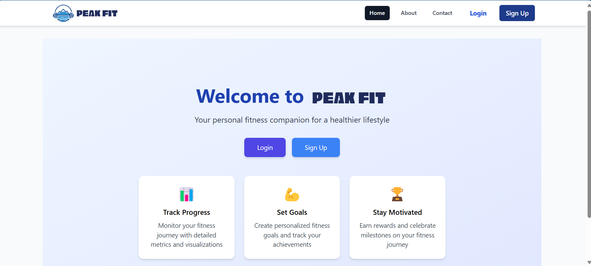
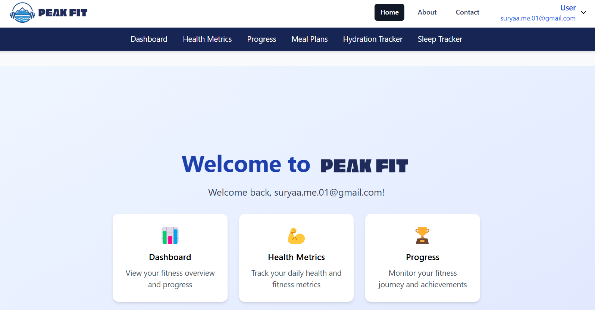
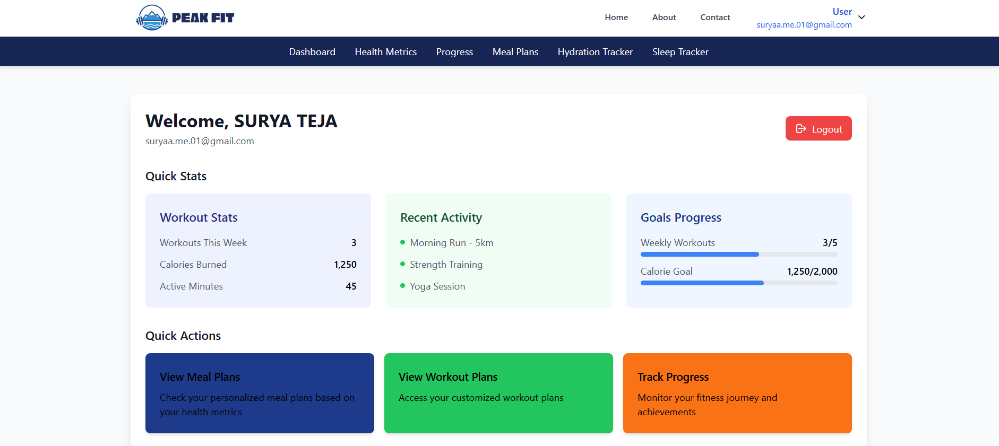
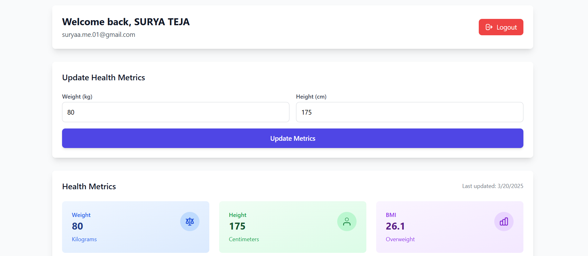
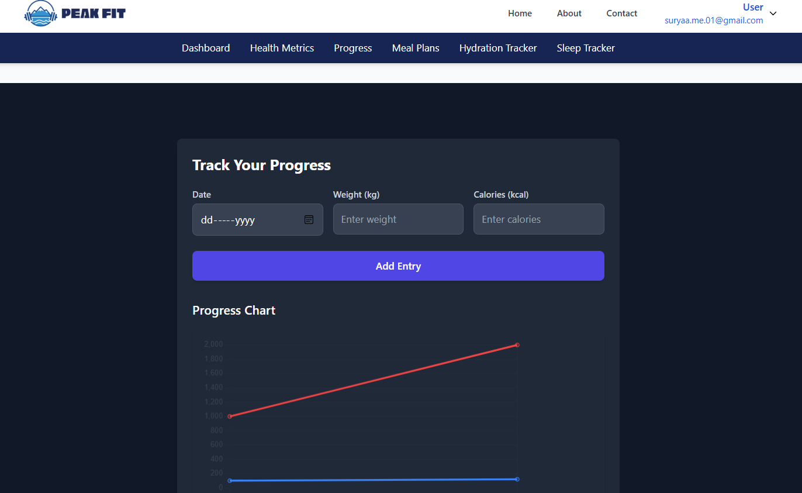
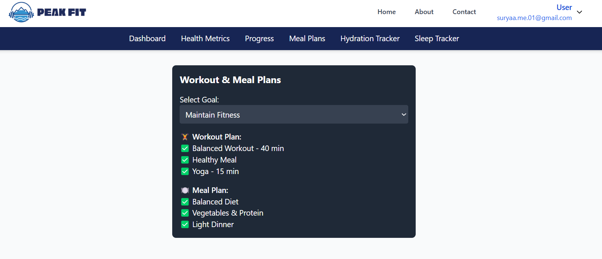
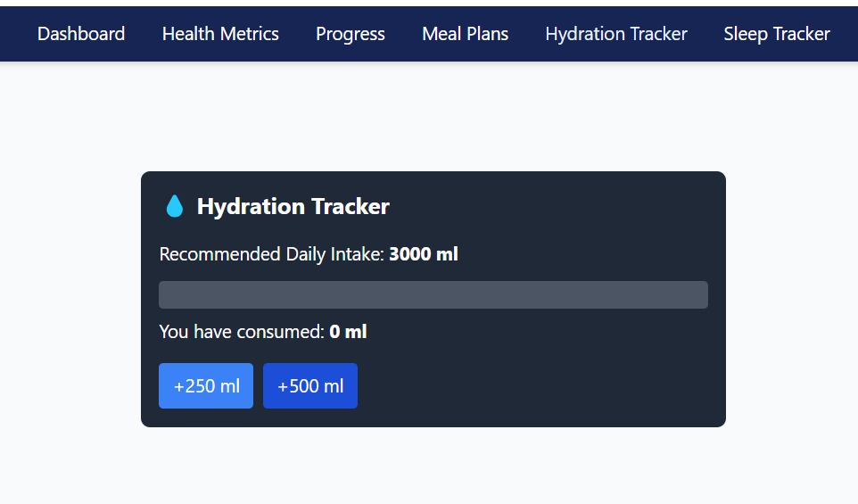
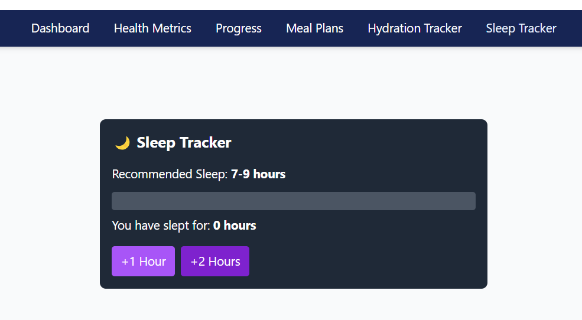
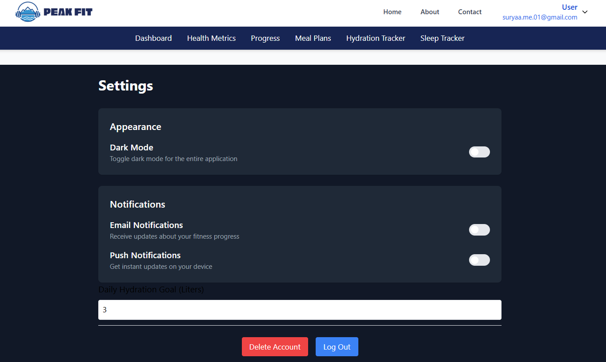

# PEAK FIT - Health & Fitness Web App

Welcome to **PEAK FIT**, a web-based health and fitness application built using the **React & Firebase**. This application helps users track their fitness journey by monitoring health metrics, meal plans, sleep, and hydration levels.

---
## Features
- **Google Authentication** for secure login
- **Personalized Dashboard** to visualize progress
- **Health Metrics Tracking** (BMI, calories, heart rate, etc.)
- **Meal Planning & Nutrition** recommendations
- **Sleep & Water Trackers** to ensure a healthy lifestyle
- **Progress Visualization** through charts




---
## Pages Overview

### **1. Home Page**
_Description_: The entry point of the application, showcasing the purpose of PEAK FIT, its features, and a call-to-action for users to sign up or log in.

**Key Sections:**
- Welcome message & app introduction
- Login/Signup (Google OAuth integration)
- Overview of features
- Testimonials and user feedback




---
### **2️. Dashboard**
 _Description_: A personalized space where users can see an overview of their fitness progress and interact with different features.

**Key Features:**
- Display of health metrics (calories, BMI, steps, etc.)
- Graphs for progress tracking
- Quick access to sleep, water, and meal planners
- Motivational quotes and tips




---
### **3️. Health Metrics Page**
_Description_: A detailed section where users can log and monitor their health-related data.

**Key Features:**
- BMI calculation and calorie tracking
- Heart rate & steps count integration
- Weekly & monthly progress reports
- Suggestions for improvement




---
### **4. Progress Tracker Page**
_Description_: A detailed section where users can log and monitor their health-related data.

**Key Features:**
- BMI calculation and calorie tracking
- Heart rate & steps count integration
- Weekly & monthly progress reports
- Suggestions for improvement



---

### **5. Meal Page**
_Description_: A nutrition guide for users to log their meals and get dietary recommendations.

**Key Features:**
- Daily meal logging (Breakfast, Lunch, Dinner, Snacks)
- Nutrition breakdown (Calories, Protein, Carbs, Fats)
- Meal recommendations based on health goals
- Recipe suggestions




---
### **6. Sleep & Water Trackers**
 _Description_: A section focused on maintaining proper hydration and sleep cycles.

**Key Features:**
- Log daily water intake
- Set reminders for hydration
- Track sleep duration and quality
- Sleep improvement suggestions


---


---
### **6. Settings Page**



---

## Tech Stack
- **Frontend**: React (Vite) + Tailwind CSS
- **Backend**: Firebase (Authentication & Database)
- **Hosting**: Firebase Hosting

---
## Project Setup
### Clone the Repository
```bash
git clone https://github.com/yourusername/PEAK_FIT.git
cd PEAK_FIT
```

### Install Dependencies
```bash
npm install
```

### Run the App Locally
```bash
npm run dev
```

### Deploy to Firebase
```bash
firebase deploy
```

---

Happy Coding! 🚀
